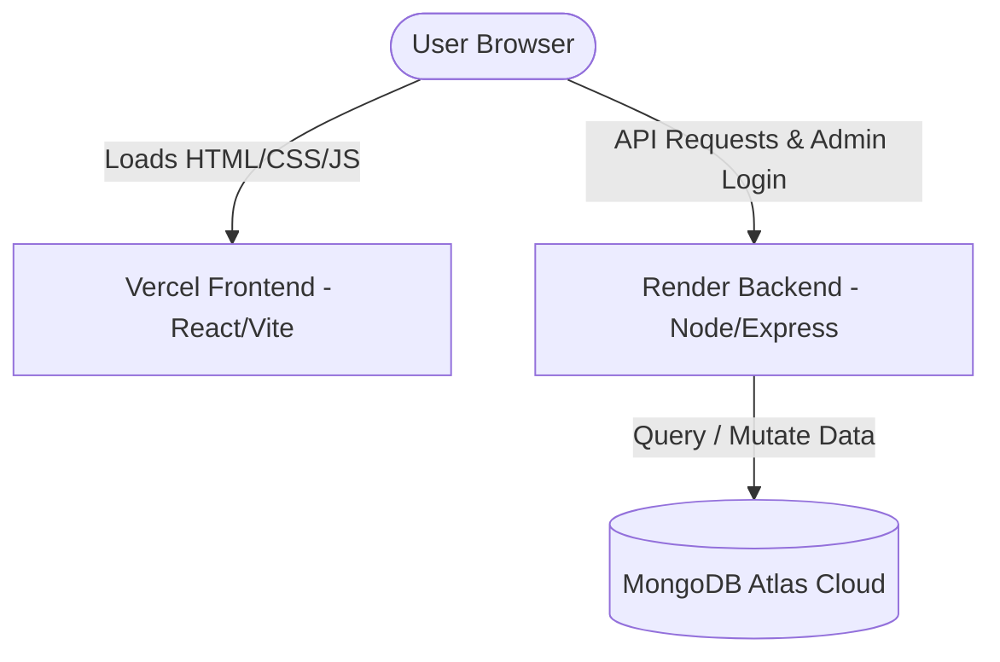

# Secure MERN Stack Portfolio - Arunabha Nag

A high-performance, responsive personal portfolio website built with the MERN Stack (MongoDB, Express, React, Node.js) and styled with Tailwind CSS. Features a visual landing page, dynamic timeline, selected projects showcase, a client-to-server contact form, and a password-protected Admin Panel to manage your site data.

---

## Core Features

* **Direct Hero Typist Headline**: A visual typewriter animation cycling through professional capabilities.
* **Persistent Light/Dark Mode**: An aesthetic switch functional on all pages (saved in localStorage).
* **Skills Marquee**: An infinite scrolling track showing current development tools.
* **Stacking Roadmap Card Timeline**: Interactive timeline cards representing academic and growth milestones that stack dynamically on scroll.
* **Marquee Project Spotlight**: Spotlight section showcasing your featured MERN project WealthifyMe.
* **CRUD Admin Panel (`/admin`)**: Secure interface to manage contact form inquiries, timeline cards, and project cards in real-time.
* **Fully Responsive**: Fluid layout scaling across Mobile, Tablet, and Desktop breakpoints.

---

## Cyber-Security Protections

This application is built from the ground up with defensive engineering protocols:
* **Helmet Headers**: Defends against MIME sniffing, clickjacking, protocol downgrades, and XSS.
* **IP Rate Limiting**: Protects login and contact forms from automated dictionary attacks and spam.
* **Payload Validation & Size Limiting**: JSON requests are capped at 10KB to shield against memory exhaustion exploits.
* **Strict CORS Parameters**: Restricts REST API CRUD operations strictly to your verified frontend domain.
* **Stored XSS Scrubbing**: Sanitizes HTML brackets on public message inputs.
* **NoSQL Injection Blockers**: Enforces strict Mongoose schemas and type checking on database variables.
* **Short-Lived JWT Sessions**: Admin login tokens expire in 2 hours to limit exposure.

---

## System Architecture



---

## Getting Started Locally

### 1. Prerequisite Setup
* Ensure Node.js (v18+) is installed.
* Get a MongoDB database connection string (local or cloud).

### 2. Configure Backend
1. Open terminal inside the `/backend` folder.
2. Create a `.env` file based on `.env.example`:
   ```env
   MONGO_URI=your_mongodb_connection_string
   PORT=5000
   JWT_SECRET=any_random_secret_string
   ADMIN_USERNAME=admin
   ADMIN_PASSWORD=admin123
   ```
3. Install dependencies:
   ```bash
   npm install
   ```
4. Seed your database:
   ```bash
   npm run seed
   ```
5. Run the dev server:
   ```bash
   npm run dev
   ```

### 3. Configure Frontend
1. Open terminal inside the `/frontend` folder.
2. Install packages:
   ```bash
   npm install
   ```
3. Run the client:
   ```bash
   npm run dev
   ```
4. Access the site locally at **`http://localhost:3000`** and the admin panel at **`http://localhost:3000/admin`**.

---

## Deploying to Production

* Detailed hosting steps for MongoDB Atlas, Render, and Vercel are available inside the local [DEPLOYMENT.md](./DEPLOYMENT.md) file.
